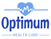

  

# Optimum 
"Optimum" is a mobile appointment management application designed for doctors, streamlining appointment scheduling, organization, and management for improved efficiency in healthcare.

## Usage
Both doctors and patients can use this app.This innovative tool streamlines scheduling, organization, and management, offering doctors a seamless interface for optimal time utilization and enhanced focus on patient care. Simultaneously, it provides patients with a user-friendly platform for easy appointment scheduling and access to healthcare services. "Optimum" serves as a bridge, fostering improved efficiency and communication between healthcare providers and their patients, ultimately creating a more streamlined and patient-centric healthcare experience.

## Features

- **Appointment Scheduling:** Easily book appointments with doctors and specialists.
- **Doctor Search:** Find healthcare providers based on specialty and availability.
- **User Profiles:** Manage your personal information and medical history.

## Live Demo

You can view the live version of OPTIMUM by visiting the official website at [Optimum Website](https://optimum-app.vercel.app).

## Authors

* [SOLTANI Mohamed Elamine](https://github.com/soltaniamine)
* [CHERGUELAINE Oussama](https://github.com/ousscher)
  
